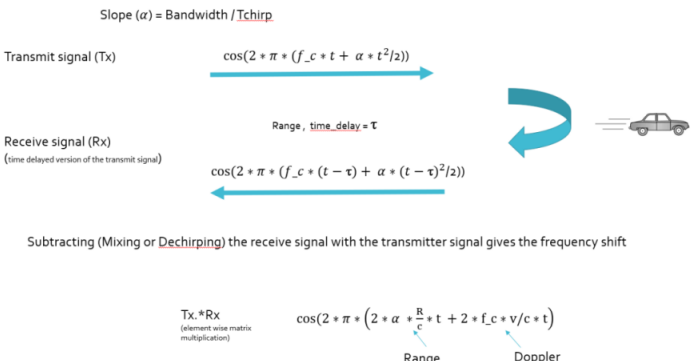

# Sensor Fusion Nanodegree

|Projects|
|---|
|[Lidar Obstacle Detection](https://github.com/ladrians/sfND_Lidar_Obstacle_Detection/blob/master/report.md)|
|[Camera Based 2D Feature Tracking](https://github.com/ladrians/sfND_2D_Feature_Tracking/blob/master/report.md)|
|[3D Object Tracking](https://github.com/ladrians/sfND_3D_Object_Tracking/blob/master/report.md)|
|[Radar Target Generation and Detection](./README.md)|
|[Unscented Kalman Filter Highway](https://github.com/ladrians/sfND_Unscented_Kalman_Filter/blob/master/report.md)|

## Radar Target Generation and Detection
Luciano Silveira
July, 2020

### Specification


## Basic Build Instructions

1. Clone this repo.
2. Create an account in Download [MATLAB](https://www.mathworks.com/mwaccount/register).
3. Download MATLAB on your computer.
4. Run [radar-target-generation-and-detection.m](radar-target-generation-and-detection.m).

### FMCW Configuration

Using the given system requirements, design a FMCW waveform. Find its Bandwidth (B), chirp time (Tchirp) and slope of the chirp.

```matlab
fc = 77.0e9; %77GHz
range_max = 200; % given radar max range
delta_r = 1; % range resolution in mts
max_vel = 70;

%speed of light = 3e8
c = 3*10^8; %300,000,000 m/s
```

Initial conditions:

```matlab
target_initial_position = 100;
target_initial_velocity = -25;
```

For given system requirements the calculated slope is `2.045455e+13`:

```matlab
Tchirp = 5.5 * (range_max*2/c);
wavelength = c/fc;
B = c/2*delta_r;
slope = B/Tchirp;
fprintf('slope %d',slope);
slope 2.045455e+13K>>
```

### Moving Target Generation

Simulate Target movement and calculate the beat or mixed signal for every timestamp.



```matlab
for i=1:length(t)
    %For each time stamp update the Range of the Target for constant velocity.
    r_t(i) = target_initial_position + target_initial_velocity * t(i);
    td(i) = 2 * r_t(i) / c;

    %For each time sample we need update the transmitted and
    %received signal.
    Tx(i) = cos(2 * pi * (fc * t(i) + (slope * t(i)^2/2)));
    Rx(i) = cos(2 * pi * (fc * (t(i) - td(i)) + (slope * (t(i) - td(i))^2/2)));

    %Now by mixing the Transmit and Receive generate the beat signal
    %This is done by element wise matrix multiplication of Transmit and
    %Receiver Signal
    Mix(i) = Tx(i) .* Rx(i);
end
```

### Signal Propagation

Implement the Range FFT on the Beat or Mixed Signal and plot the result.


### Processing Received Reflected Signal

### Range/Doppler FFT

The Range Doppler Map for the 2nd FFT:


#### CFAR Detection

Selection of the number of Training and guard cells for each dimension:

```matlab
Tr = 10;
Td = 8;
Gr = 4;
Gd = 4;
```

`Offset` selection of `10`, lower values does not filter it correctly and higher values do not get anything to process.

The process slides the cell under test across the complete matrix; making sure the CUT has margin for Training and Guard cells from the edges.

On every iteration; the sum the signal level within all the training cells are converted to logarithmic value using the [db2pow function](https://www.mathworks.com/help/releases/R2020a/signal/ref/db2pow.html).
Averaged the summed values for all of the training cells used, convert it back to logarithmic using the [pow2db function](https://www.mathworks.com/help/releases/R2020a/signal/ref/pow2db.html).

Further add the offset to it to determine the threshold and then compare the signal under CUT against this threshold. If the CUT level > threshold assign it a value of 1, else equate it to 0.


```matlab
cutRDM = zeros(size(RDM));
for i = Tr+Gr+1:Nr/2-Tr-Gr
    for j = Td+Gd+1:Nd-Td-Gd
        noise_level = zeros(1,1);
        %For every iteration sum the signal level within all the training cells.
        for p = i-Tr-Gr:i+Tr+Gr
            for q = j-Td-Gd:j+Td+Gd
                % convert the value from logarithmic to linear using db2pow
                if (abs(i-p) > Gr || abs(j-q) > Gd)
                    noise_level = noise_level + db2pow(RDM(p,q));
                end
            end
        end
        %Average the summed values for all of the training cells, convert it back to logarithimic using pow2db.
        threshold = pow2db(noise_level/elems_count);
        %add the offset to it to determine the threshold.
        threshold = threshold + offset;
        if (RDM(i,j) > threshold) % CUT level > threshold?
            cutRDM(i,j) = 1;
        else
            cutRDM(i,j) = 0;
        end
    end
end
```

It was not needed to equate all the non-thresholded cells to 0 to suppress the noise and separate the target signal because the `cut` matrix was initialized with zero values.


### Links

 * [Project Rubric](https://review.udacity.com/#!/rubrics/2548/view)
 * [Code](radar_target_generation_and_detection.m)
 * [This project](https://github.com/ladrians/sfND_Radar_Target_Generation_and_Detection)
